# Matthew Whited - Detailed Career Progression

Comprehensive timeline showing overlapping responsibilities, crisis resolution pattern, and technical innovation milestones across 25+ years of technology leadership.

## Matthew Whited - Detailed Career Progression

25+ Years: Electronics Technician → Fractional CTO & Crisis Resolution Specialist

```plantuml
@startgantt
project starts 1998-01-01
printscale yearly

-- Foundation Years (1998-2006) --
[Electronics Technician Certification] starts 1998-09-01 and ends 2000-06-30 and is colored in LightBlue
note bottom
    SkillsUSA First Place, Student Teaching Networking
end note
[Systems Engineer - Eastland-Fairfield] starts 2000-07-01 and ends 2006-08-31 and is colored in Green
note bottom
    3,500+ computers, ILOVEYOU virus cleanup, Department Head
end note
[DeVry Electronic Engineering] starts 2000-01-01 and ends 2002-12-31 and is colored in LightBlue

-- Career Transition (2006-2010) --
[Software Engineer - 3SG] starts 2006-08-01 and ends 2007-08-31 and is colored in Orange
note bottom
    DBA→Developer transition, Barcode inventory system
end note
[.NET Developer Contracting Era] starts 2007-08-01 and ends 2010-09-30 and is colored in DarkOrange
note bottom
    SafeAuto, EmpowerID, TEKsystems, JPMorgan Chase, United Healthcare
end note

-- CTO Leadership & FDA Compliance (2009-2015) --
[Chief Technology Officer - Itrica] starts 2009-11-01 and ends 2015-07-31 and is colored in Red
note bottom
    FDA compliance, Big Pharma (Sanofi, AstraZeneca), Harvard Medical TIMI
end note
[Merit-Based CTO Promotion] happens 2010-01-01 and is colored in Red
note bottom
    "Most skilled senior architect on team"
end note
[FDA Auditor Direct Interface] happens 2012-01-01 and is colored in Red

-- Principal Architect Era (2015-2024) --
[Out-of-Band Development Consulting] starts 2015-03-01 and ends 2025-12-31 and is colored in Gray
note bottom
    Independent crisis resolution, vendor-neutral advisory
end note
[Principal Solutions Architect - Eliassen] starts 2015-09-01 and ends 2024-10-31 and is colored in Purple
note bottom
    Full-time architect, framework development, strategic technology
end note

-- Leadership Evolution --
[Rose and Gold Foundation Board] starts 2017-01-01 and ends 2020-12-31 and is colored in Pink
note bottom
    Nonprofit board governance, software automation
end note
[Centers of Excellence Lead] starts 2022-07-01 and ends 2024-10-31 and is colored in DarkPurple
note bottom
    125+ developers, 10-15 teams, training programs
end note

-- Crisis Resolution Specialist Era (2024-Present) --
[AI/ML Crisis Specialist - ERisk] starts 2024-11-01 and ends 2025-08-31 and is colored in Magenta
note bottom
    1-week delivery after 12 months failed attempts
end note
[Principal Solutions Architect - Green Onion] starts 2025-02-01 and ends 2025-12-31 and is colored in DarkGreen
note bottom
    77% Azure cost reduction, application rescue
end note

-- Technical Innovation Timeline --
[Apple IIc BASIC (Self-Taught Origin)] happens 1996-01-01 and is colored in Yellow
note bottom
    Career origin: reverse engineering BASIC games
end note
[Novell ClientTrust Protocol Engineering] happens 2003-01-01 and is colored in Cyan
note bottom
    Implementation became official Novell product basis
end note
[Custom LDAP Server Implementation] happens 2008-01-01 and is colored in Cyan
note bottom
    RFC analysis and Wireshark reverse engineering
end note
[CTS SQLCLR JSON Processing] happens 2012-01-01 and is colored in Cyan
note bottom
    Custom SQL Server CLR plugin wrapping JSON.NET
end note
[Custom Microprocessor Design (MW16C)] happens 2018-01-01 and is colored in Cyan
note bottom
    Complete 16-bit CPU with SystemVerilog implementation
end note
[SQL Server Vector Extensions] happens 2020-01-01 and is colored in Cyan
note bottom
    Pioneer: Vector database before commercial offerings
end note
[Hybrid Search Engine Development] happens 2024-01-01 and is colored in Cyan
note bottom
    Combining semantic similarity with keyword matching
end note

-- Community Authority Milestones --
[Stack Overflow Account Creation] happens 2008-01-01 and is colored in Gold
[First NuGet Package] happens 2015-01-01 and is colored in Orange
[Stack Overflow Gold Badge] happens 2015-01-01 and is colored in Gold
note bottom
    C# expertise, 22,433+ reputation, 4.7M developer reach
end note
[Arctic Code Vault Contributor] happens 2020-01-01 and is colored in LightBlue
[22K+ Stack Overflow Reputation] happens 2023-01-01 and is colored in Gold
[652K+ NuGet Downloads] happens 2024-01-01 and is colored in Orange
note bottom
    20 packages, professional CI/CD, community adoption
end note

-- Crisis Resolution Pattern --
[3SG Project Crisis Recovery] happens 2007-01-01 and is colored in Red
note bottom
    Scanning accuracy <75% to >95%, prevented contract loss
end note
[United Healthcare $500K Risk Prevention] happens 2009-01-01 and is colored in Red
note bottom
    Configuration management preventing documented overcharge
end note
[Sedgwick Form Engine Crisis] happens 2020-01-01 and is colored in Red
note bottom
    Custom JSON path-based ETL tool rescue
end note
[Eli Product Replacement Crisis] happens 2023-01-01 and is colored in Red
note bottom
    Superior replacement in hours vs 6+ months original
end note
[ERisk AI/ML Crisis Recovery] happens 2024-11-01 and is colored in Red
note bottom
    1-week vs 12-month failure, working prototype delivery
end note
[Green Onion Application Rescue] happens 2025-02-01 and is colored in Red
note bottom
    77% cost reduction, complete system redesign
end note

@endgantt
```

## Career Progression Analysis

### Foundation & Learning Phase (1998-2006)
- **Self-Taught Programming Excellence:** Started with Apple IIc BASIC reverse engineering
- **Enterprise IT Leadership:** Managed 3,500+ computers, network architecture, budget oversight
- **Early Recognition:** Offered position before graduation due to ILOVEYOU virus response
- **Educational Foundation:** Electronics technician certification, DeVry electronic engineering

### Professional Development & Specialization (2006-2015)
- **Career Transition Success:** Database administrator to primary developer at 3SG
- **Contract Development Mastery:** Multiple high-profile clients including JPMorgan Chase, United Healthcare
- **CTO Merit Promotion:** Recognized as "most skilled senior architect on team"
- **FDA Compliance Leadership:** Direct auditor interaction for life-critical systems

### Principal Architect & Strategic Leadership (2015-2024)
- **Independent Consulting Launch:** Vendor-neutral crisis resolution services
- **Framework Architecture Innovation:** Shared framework transformation with lasting organizational impact
- **Centers of Excellence Leadership:** Influenced 125+ developers across 10-15 teams
- **Training & Mentorship:** Comprehensive developer education programs

### Crisis Resolution Specialist Era (2024-Present)
- **AI/ML Crisis Mastery:** 1-week delivery after 12 months of failed attempts by others
- **Application Rescue Success:** 77% Azure cost reduction while leading complete system redesign
- **Vendor-Neutral Advisory:** Independent technology guidance preventing costly mistakes

## Technical Innovation Pattern

### Early Innovation (2000-2008)
- **Protocol Engineering:** Novell ClientTrust implementation became official product basis
- **Custom LDAP Server:** RFC analysis and Wireshark reverse engineering
- **Enterprise Integration:** WCF services bridging mainframe and modern systems

### Advanced Technical Leadership (2008-2020)
- **Database Innovation:** SQLCLR JSON processing, custom SQL Server extensions
- **Hardware Design Mastery:** Complete 16-bit microprocessor (MW16C) with SystemVerilog
- **Framework Development:** Enterprise-scale reusable middleware and automation

### AI/ML Pioneer & Modern Innovation (2020-Present)
- **Vector Database Pioneer:** SQL Server vector extensions before commercial offerings
- **Hybrid Search Engines:** Combining traditional SQL with modern vector search
- **Pure .NET AI/ML:** Enterprise-friendly implementations without Python dependencies

## Community Authority Building

### Technical Expertise Recognition
- **Stack Overflow Gold Badge:** C# expertise with 22,433+ reputation reaching 4.7M developers
- **Open Source Leadership:** 652K+ NuGet downloads across 20 packages
- **Arctic Code Vault:** Permanent preservation of critical open source contributions

### Crisis Resolution Reputation
- **Consistent Pattern:** Project recovery success across multiple organizations and decades
- **Quantifiable Results:** Cost reductions, performance improvements, rapid delivery
- **Strategic Impact:** Technology risk management and vendor-neutral guidance