# Matthew Whited - Career Timeline

Basic chronological view of career progression from electronics technician to fractional CTO and crisis resolution specialist.

title Matthew Whited - Career Timeline
subtitle Fractional CTO, Principal Solutions Architect & Crisis Resolution Specialist

```plantuml
@startgantt
project starts 1996-01-01
printscale yearly

-- Education & Foundation --
[Electronics Technician] starts 1998-01-01 and ends 2000-06-30 and is colored in LightBlue
[DeVry Electronic Engineering] starts 2000-01-01 and ends 2002-12-31 and is colored in LightBlue

-- Early Career (2000-2010) --
[Systems Engineer/Dept Head - Eastland-Fairfield] starts 2000-07-01 and ends 2006-08-31 and is colored in Green
note bottom
    3,500+ computers, ILOVEYOU virus cleanup, Department Head
end note
[Software Engineer - 3SG Corporation] starts 2006-08-01 and ends 2007-08-31 and is colored in Orange
note bottom
    DBA→Developer transition, Barcode inventory system
end note
[.NET Developer - SafeAuto] starts 2007-01-01 and ends 2007-12-31 and is colored in Orange
[.NET Developer - Dot Net Factory/EmpowerID] starts 2007-08-01 and ends 2008-04-30 and is colored in Orange
[Senior .NET Developer - TEKsystems] starts 2007-08-01 and ends 2010-09-30 and is colored in DarkOrange
note bottom
    JPMorgan Chase, United Healthcare, $500K risk prevention
end note

-- CTO Leadership Era (2009-2015) --
[Chief Technology Officer - Itrica] starts 2009-11-01 and ends 2015-07-31 and is colored in Red
note bottom
    FDA compliance, Big Pharma (Sanofi, AstraZeneca), Harvard Medical
end note

-- Principal Architect Era (2015-Present) --
[Principal Solutions Architect - Eliassen] starts 2015-09-01 and ends 2024-10-31 and is colored in Purple
note bottom
    Framework development, strategic technology leadership
end note
[Centers of Excellence Lead] starts 2022-07-01 and ends 2024-10-31 and is colored in DarkPurple
note bottom
    125+ developers, 10-15 teams, training programs
end note
[AI/ML Crisis Specialist - ERisk] starts 2024-11-01 and ends 2025-08-31 and is colored in Magenta
note bottom
    1-week delivery after 12 months failed attempts
end note
[Principal Solutions Architect - Green Onion] starts 2025-02-01 and ends 2025-12-31 and is colored in DarkGreen
note bottom
    77% Azure cost reduction, application rescue
end note

-- Continuous Consulting --
[Out-of-Band Development Consulting] starts 2015-03-01 and ends 2025-12-31 and is colored in Gray
note bottom
    Independent crisis resolution, vendor-neutral advisory
end note

-- Board & Community Service --
[Rose and Gold Foundation - Board Member] starts 2017-01-01 and ends 2020-12-31 and is colored in Pink

-- Technology Evolution Milestones --
[Self-Taught Programming (Apple IIc)] happens 1996-01-01 and is colored in LightGray
note bottom
    Career origin: reverse engineering BASIC games
end note
[ILOVEYOU Virus Cleanup (Career Origin)] happens 2000-05-01 and is colored in Yellow
note bottom
    Offered job before graduation
end note
[FDA Auditor Direct Interface] happens 2012-01-01 and is colored in Red
[Centers of Excellence Leadership] happens 2022-07-01 and is colored in DarkPurple
[AI/ML Crisis Resolution] happens 2024-11-01 and is colored in Magenta
[77% Azure Cost Reduction] happens 2025-02-01 and is colored in DarkGreen

-- Key Technical Achievements --
[Novell ClientTrust Protocol] happens 2003-01-01 and is colored in Cyan
note bottom
    Implementation became official Novell product basis
end note
[Custom Microprocessor Design] happens 2018-01-01 and is colored in Cyan
note bottom
    MW16C: Complete 16-bit CPU with SystemVerilog
end note
[SQL Server Vector Extensions] happens 2020-01-01 and is colored in Cyan
note bottom
    Pioneer: Vector database before commercial offerings
end note
[Hybrid Search Engine] happens 2024-01-01 and is colored in Cyan
note bottom
    Combining semantic similarity with keyword matching
end note

-- Community Impact --
[Stack Overflow Gold Badge] happens 2015-01-01 and is colored in Gold
note bottom
    22,433+ reputation, C# expertise, 4.7M developer reach
end note
[Arctic Code Vault Contributor] happens 2020-01-01 and is colored in LightBlue
[652K+ NuGet Downloads] happens 2023-01-01 and is colored in Orange
note bottom
    20 packages, professional CI/CD, community adoption
end note

@endgantt
```

## Key Career Highlights

### Foundation Phase (1998-2006)
- **Electronics Technician Certification** with SkillsUSA first place regional
- **Enterprise IT Leadership** managing 3,500+ computers across multiple campuses
- **Career Origin Story** through ILOVEYOU virus cleanup leading to job offer before graduation

### Development Transition (2006-2015)
- **Career Pivot** from IT management to software development
- **CTO Leadership** at FDA-compliant life sciences company
- **Big Pharma Experience** with Sanofi, AstraZeneca, GSK partnerships

### Principal Architect Era (2015-Present)
- **Centers of Excellence Leadership** influencing 125+ developers across 10-15 teams
- **Crisis Resolution Specialist** pattern established across multiple organizations
- **AI/ML Innovation Pioneer** with pre-mainstream adoption and pure .NET implementations

### Current Strategic Positioning (2025)
- **Fractional CTO** and vendor-neutral technology advisor
- **Crisis Resolution Expert** delivering 77% cost reductions and rapid project recovery
- **Community Authority** with 652K+ NuGet downloads and 22K+ Stack Overflow reputation