# Matthew Whited - Career Evolution by Technology Leadership Phases

Strategic view of career progression organized by major technology leadership phases, showing evolution from hardware foundation to AI/ML crisis resolution specialist.

```plantuml
@startgantt
project starts 1996-01-01
printscale yearly
-- Phase 1: Hardware Foundation & Self-Taught Programming (1996-2006) --

[Self-Taught Programming Era] starts 1996-01-01 and ends 2006-08-31
note bottom 
    Apple IIc BASIC → QBasic → Visual Basic → C/C++ → .NET
end note
[Electronics Education] starts 1998-09-01 and ends 2002-12-31 and is colored in LightBlue
[Enterprise IT Leadership] starts 2000-07-01 and ends 2006-08-31 and is colored in Green 
note bottom
    3,500+ computers, network architecture, department management
end note

-- Phase 2: .NET Mastery & Enterprise Development (2006-2015) --
[.NET Developer Transition] starts 2006-08-01 and ends 2010-09-30 and is colored in Orange
note bottom
    Career pivot from IT to development, financial/healthcare systems
end note
[CTO & FDA Compliance Leadership] starts 2009-11-01 and ends 2015-07-31 and is colored in Red
note bottom
    Life-critical systems, Big Pharma, regulatory compliance mastery
end note

-- Phase 3: Principal Architect & Framework Innovation (2015-2024) --
[Independent Consulting Launch] starts 2015-03-01 and ends 2025-12-31 and is colored in Gray
[Enterprise Architecture Leadership] starts 2015-09-01 and ends 2024-10-31 and is colored in Purple
note bottom
    Framework development, Centers of Excellence, 125+ developer influence
end note
[Community Authority Building] starts 2015-01-01 and ends 2026-01-31 and is colored in Gold
note bottom
    Stack Overflow expertise, NuGet packages, open source leadership
end note

-- Phase 4: AI/ML Pioneer & Crisis Resolution (2020-Present) --
[AI/ML Innovation Leadership] starts 2020-01-01 and ends 2026-01-31 and is colored in Magenta
note bottom
    Vector databases, hybrid search, pure .NET implementations
end note
[Crisis Resolution Specialist] starts 2024-11-01 and ends 2026-01-31 and is colored in DarkRed
note bottom
    1-week vs 12-month failures, 77% cost reductions, application rescue
end note

-- Technology Evolution Markers --
[Hardware Design Mastery] happens 2000-01-01 and is colored in Blue
note bottom
    Electronics technician, VHDL, microprocessor design
end note
[Protocol Engineering Expertise] happens 2008-01-01 and is colored in Cyan
note bottom
    LDAP servers, ClientTrust, reverse engineering
end note
[Database Innovation Pioneer] happens 2012-01-01 and is colored in Green
note bottom
    SQLCLR JSON, vector extensions, performance optimization
end note
[AI/ML Foresight & Implementation] happens 2020-01-01 and is colored in Purple
note bottom
    Pre-mainstream adoption, hybrid search, production systems
end note
[Fractional CTO Positioning] happens 2025-01-01 and is colored in DarkGreen
note bottom
    Strategic advisory, vendor-neutral guidance, executive positioning
end note

-- Career Defining Moments --
[ILOVEYOU Virus Response] happens 2000-05-01 and is colored in Yellow
note bottom
    Career origin story, offered job before graduation
end note
[Merit-Based CTO Promotion] happens 2010-01-01 and is colored in Red
note bottom
    "Most skilled senior architect on team"
end note
[Open Source Framework Leadership] happens 2020-01-01 and is colored in Orange
note bottom
    Community impact, technical validation, industry influence
end note
[AI/ML Crisis Mastery] happens 2024-11-01 and is colored in Magenta
note bottom
    Proven crisis resolution pattern, rapid technical delivery
end note

@endgantt
```

## Strategic Career Phase Analysis

### Phase 1: Hardware Foundation & Self-Taught Programming (1996-2006)
**Core Theme:** Building foundational technical excellence through self-directed learning and enterprise IT leadership

#### Key Achievements
- **Self-Taught Programming Mastery:** Apple IIc BASIC → Visual Basic → C/C++ → .NET progression
- **Enterprise IT Leadership:** 3,500+ computer infrastructure management
- **Career Origin Story:** ILOVEYOU virus response leading to job offer before graduation
- **Electronics Foundation:** Hardware understanding informing software architecture decisions

#### Strategic Value
- **Technical Breadth:** Hardware-to-software understanding providing unique perspective
- **Self-Learning Excellence:** Demonstrated ability to master complex systems independently
- **Leadership Capability:** Department head responsibilities with budget and strategic planning
- **Crisis Response:** Early pattern of being called for critical technical challenges

### Phase 2: .NET Mastery & Enterprise Development (2006-2015)
**Core Theme:** Transitioning from IT management to development leadership with regulatory compliance mastery

#### Key Achievements
- **Career Pivot Success:** Database administrator to primary developer at 3SG Corporation
- **High-Profile Client Experience:** JPMorgan Chase, United Healthcare, SafeAuto contracts
- **CTO Merit Promotion:** Recognized as "most skilled senior architect on team"
- **FDA Compliance Leadership:** Direct auditor interaction for life-critical clinical trial systems

#### Strategic Value
- **Enterprise Development Expertise:** Financial and healthcare systems requiring high reliability
- **Regulatory Compliance Mastery:** FDA auditor interface for Big Pharma partnerships
- **Technical Leadership Recognition:** Merit-based promotion to executive technology role
- **Crisis Project Recovery:** Pattern of rescuing failing projects and preventing costly mistakes

### Phase 3: Principal Architect & Framework Innovation (2015-2024)
**Core Theme:** Establishing technical authority through framework development and community leadership

#### Key Achievements
- **Independent Consulting Launch:** Vendor-neutral crisis resolution and strategic advisory
- **Framework Architecture Innovation:** Shared framework with lasting organizational impact
- **Centers of Excellence Leadership:** 125+ developer influence across 10-15 teams
- **Community Authority Building:** 796K+ NuGet downloads, 22K+ Stack Overflow reputation

#### Strategic Value
- **Vendor-Neutral Positioning:** Independent technology guidance without bias or partnerships
- **Organizational Impact:** Enterprise-wide standards and best practices establishment
- **Technical Innovation:** Custom microprocessor design, database extensions, protocol engineering
- **Knowledge Transfer Excellence:** Comprehensive training and mentorship programs

### Phase 4: AI/ML Pioneer & Crisis Resolution (2020-Present)
**Core Theme:** Leveraging technical foresight and crisis resolution expertise for strategic positioning

#### Key Achievements
- **AI/ML Innovation Pioneer:** Vector databases and hybrid search before mainstream adoption
- **Crisis Resolution Mastery:** 1-week delivery after 12 months of failed attempts by others
- **Cost Optimization Excellence:** 77% Azure cost reduction while rescuing failing applications
- **Strategic Executive Positioning:** Fractional CTO and vendor-neutral technology advisor

#### Strategic Value
- **Technology Foresight:** Implementing advanced solutions before market adoption
- **Crisis Resolution Reputation:** Proven pattern of rescuing failing projects across organizations
- **Executive Advisory Capability:** Strategic technology guidance for growing companies
- **Vendor-Neutral Authority:** Independent expertise preventing costly technology mistakes

## Career Evolution Insights

### Consistent Patterns Across Phases
1. **Crisis Resolution Expertise:** Called when projects fail or critical challenges arise
2. **Technical Innovation Leadership:** First-to-market implementations becoming industry standards
3. **Self-Directed Learning Excellence:** Mastering complex systems through experimentation and analysis
4. **Community Authority Building:** Sharing knowledge and establishing technical credibility

### Strategic Positioning Evolution
- **Phase 1-2:** Building technical foundation and enterprise experience
- **Phase 3:** Establishing authority through framework development and community impact
- **Phase 4:** Leveraging expertise for strategic advisory and fractional executive services

### Technology Leadership Differentiation
- **Hardware-Software Integration:** Unique perspective from electronics foundation to AI/ML
- **Crisis Resolution Specialist:** Proven track record when others fail
- **Vendor-Neutral Guidance:** Independent technology assessment and strategic advisory
- **Community Authority:** Validated expertise through open source and knowledge sharing